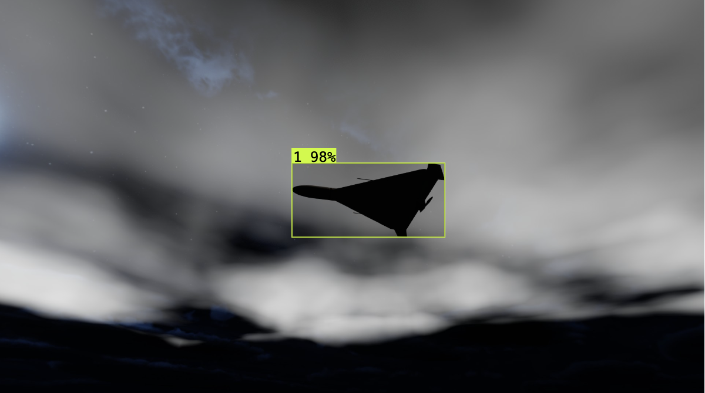
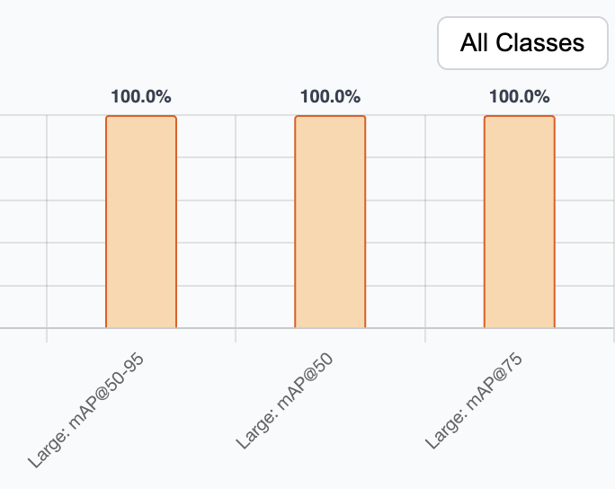

# Combat Drone Detection Dataset Generator

## TL;DR:

Building high-quality datasets for combat drone detection is challenging due to safety risks, legal restrictions, and extreme scarcity of real-world imagery. **SynthDataGen** solves this by providing a toolkit to generate unlimited synthetic, labeled datasets of combat drones in minutes. We Achieved **0.99 mAP@50-95** on combat drone detection.


## Why Synthetic Data?

- 🚫 **Safety First**: No need for real drone footage or dangerous field operations
- 📸 **Data Scarcity**: Real combat drone images are rare and restricted
- ⚡ **Speed**: Generate thousands of labeled images in minutes
- 🔄 **Iteration**: Rapid dataset creation → train → test → improve loop

## Key Features

- **Instant Dataset Generation**: Create diverse synthetic datasets with configurable parameters
- **Multi-Drone Support**: Train detectors for Shahed-136, STC Orlan-10, and other models
- **Environmental Variability**: Control lighting, weather, altitude, distance, drone orientation
- **Automatic Labeling**: YOLO format bounding boxes with visual overlays
- **High Performance**: Achieved **0.99 mAP@50-95** on combat drone detection
- **Customizable**: Thousands of parameter combinations for domain-specific datasets

## How It Works

1. **Configure** drone types, environmental conditions, and camera parameters
2. **Generate** synthetic images with automatic bounding box labels
3. **Export** in YOLOv11 format with `data.yaml`
4. **Train** your detection model with the generated dataset
5. **Iterate** with different parameters for improved results

## Quick Start

```csharp
// Configure dataset parameters
- Select drone prefabs
- Set altitude/distance ranges
- Choose lighting and weather conditions
- Click "Generate Dataset"
```

Generated dataset structure:
```
dataset/
├── train/images & labels/
├── val/images & labels/
├── test/images & labels/
└── data.yaml
```

## Performance

Our synthetic datasets achieve **state-of-the-art** results:
- **mAP@50-95**: 0.99 on combat drone detection
- **Real-world generalization**: Strong transfer to actual footage
- **Fast training cycles**: Minutes from dataset generation to trained model

## Coming Soon

📦 **Free Sample Dataset**: Thousands of labeled synthetic drone images in YOLOv11 format  
🤖 **Pre-trained Models**: Ready-to-use combat drone detectors  
📊 **Benchmark Results**: Comparative analysis with real-world data

## Requirements

- Window, Linux, or macOS machine
- GPU recommended


---

**Join us in building safer, smarter combat drone detection systems through synthetic data.**

